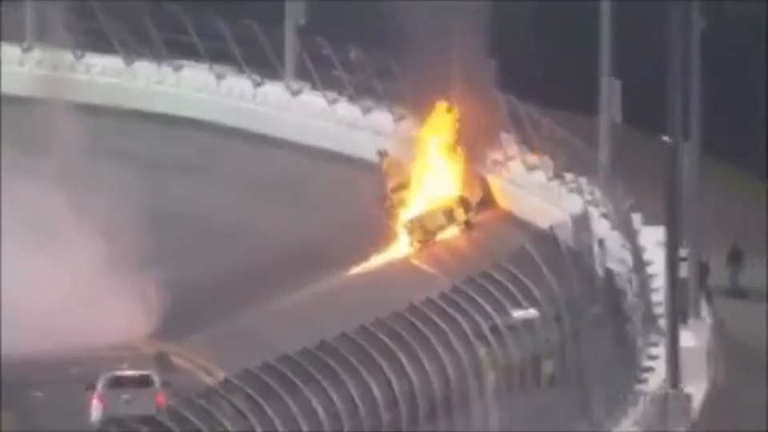
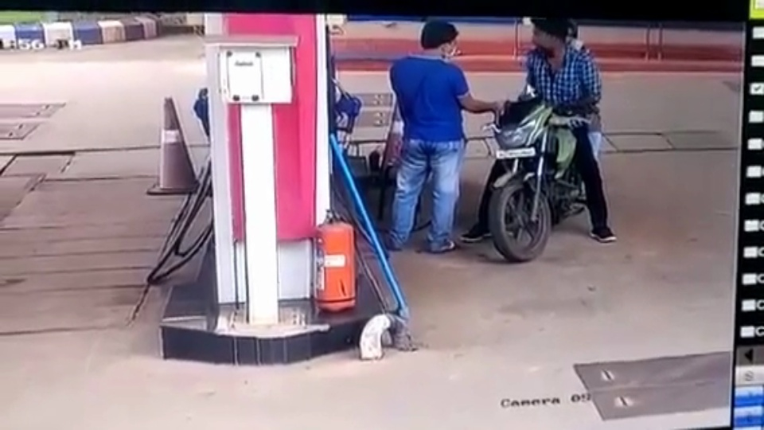
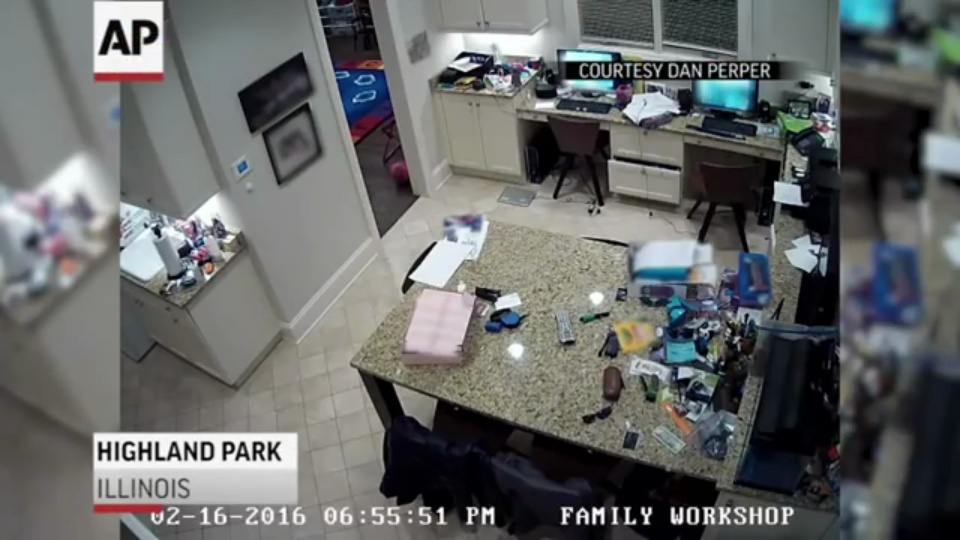

# Fire and Vehicle Crash Detection

A real-time computer vision pipeline for detecting fire and vehicle crash events from video streams. The project includes the original OpenCV fire detector plus an upgraded configurable pipeline with YOLOv8 crash detection, TensorFlow fire classification, HSV fire fallback detection, annotated video output, and REST webhook alerts.

## Quick Start

### Clone and Run

1. **Clone the repository:**
   ```bash
   git clone https://github.com/ismayank/Fire.git
   cd Fire
   ```

2. **Install dependencies:**
   ```bash
   pip install -r requirements.txt
   ```

3. **Run the application:**
   ```bash
   python3 run.py
   ```

4. **Open your browser and navigate to:**
   ```
   http://localhost:5001
   ```

### System Requirements

- Python 3.8 or higher
- pip package manager
- Webcam (for real-time detection)
- Modern web browser

### Dependencies

The application automatically installs all required dependencies:
- OpenCV (Computer Vision)
- Flask (Web Framework)
- TensorFlow/Keras (Machine Learning)
- YOLOv8 (Object Detection)
- NumPy (Numerical Computing)

## Demo

| Car fire detection | Bike fire detection | Building fire detection |
| --- | --- | --- |
|  |  |  |

## Features

- Real-time video processing from a webcam, local video file, or stream URL.
- YOLOv8-based vehicle crash detection with configurable confidence and NMS IoU thresholds.
- TensorFlow fire classifier support for custom trained fire/no-fire models.
- HSV-based fire detection fallback so the included sample videos can run without a trained model.
- REST webhook alert pipeline for dashboards, monitoring tools, or backend services.
- Cooldown-based alert throttling to reduce duplicate notifications.
- Optional base64 JPEG snapshot attachment in webhook payloads.
- Annotated OpenCV preview window and optional annotated output video export.

## Tech Stack

- Python
- OpenCV
- NumPy
- Ultralytics YOLOv8
- TensorFlow / Keras
- REST webhooks

## Project Structure

```text
.
├── Fd.py
├── realtime_detection.py
├── config.example.json
├── requirements.txt
├── README.md
├── assets/
│   ├── bike-fire-detection.jpg
│   ├── building-fire-detection.jpg
│   └── car-fire-detection.jpg
├── bike-fire.mp4
├── car-fire.mp4
├── car-fire-2.mp4
├── fire3.mp4
├── fire4.mp4
└── test1.mp4
```

## Installation

Clone the repository:

```bash
git clone git@github.com:ismayank/Fire.git
cd Fire
```

Create a virtual environment:

```bash
python -m venv .venv
source .venv/bin/activate
```

Install dependencies:

```bash
pip install -r requirements.txt
```

## Quick Start

Run the upgraded detector with the included sample video:

```bash
python realtime_detection.py --config config.example.json
```

Run headless without opening an OpenCV window:

```bash
python realtime_detection.py --config config.example.json --headless
```

Override the input source:

```bash
python realtime_detection.py --config config.example.json --source bike-fire.mp4
```

Use webcam input:

```bash
python realtime_detection.py --config config.example.json --source 0
```

## Configuration

Edit `config.example.json` to enable YOLOv8 crash detection, TensorFlow fire classification, webhook alerts, or output video export.

```json
{
  "video_source": "car-fire-2.mp4",
  "display": true,
  "output_path": "outputs/demo.mp4",
  "webhook_url": "https://example.com/alerts",
  "yolo": {
    "enabled": true,
    "model_path": "models/crash_yolov8.pt",
    "confidence": 0.45,
    "iou": 0.5,
    "crash_classes": ["accident", "crash", "vehicle_crash", "damaged_vehicle"]
  },
  "tensorflow_fire": {
    "enabled": true,
    "model_path": "models/fire_classifier",
    "threshold": 0.7
  }
}
```

By default, YOLOv8 and TensorFlow are disabled because trained model files are not committed to this repository. The HSV fallback is enabled so the demo videos work immediately.

## Webhook Payload

When `webhook_url` is configured, the pipeline sends JSON like this:

```json
{
  "event": "fire",
  "confidence": 0.92,
  "source": "tensorflow",
  "box": {
    "x1": 0,
    "y1": 0,
    "x2": 960,
    "y2": 540
  },
  "timestamp": 1710000000
}
```

Set `include_snapshot_in_webhook` to `true` if your monitoring backend should receive a base64-encoded JPEG snapshot with each alert.

## Legacy Script

The original OpenCV-only script is still available:

```bash
python Fd.py
```

It uses HSV color masking and Gmail SMTP alerts. For real deployments, move credentials out of source code and into environment variables or a local `.env` file.

## Notes

- The included videos are demo assets for validating the pipeline.
- HSV fire detection can produce false positives on red/orange objects or reflections.
- For production monitoring, combine model-based detection, threshold tuning, alert retries, logging, and device-specific optimization.
